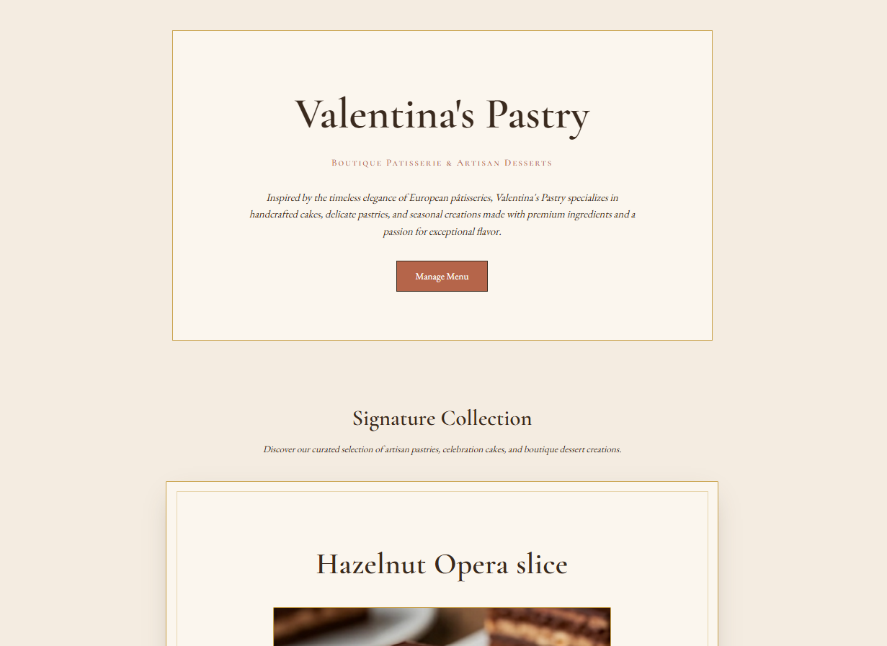
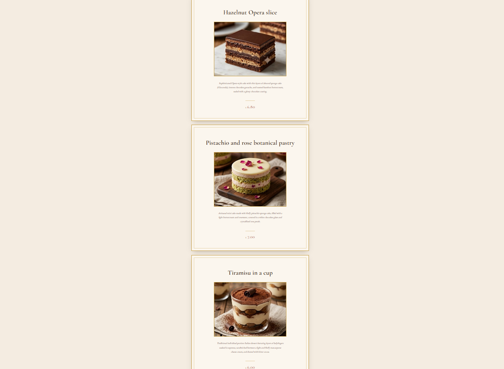
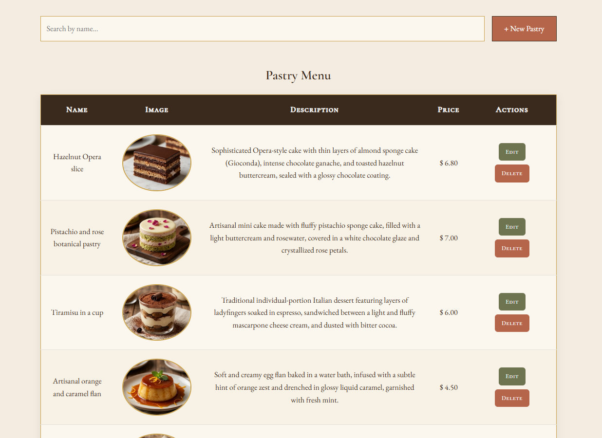
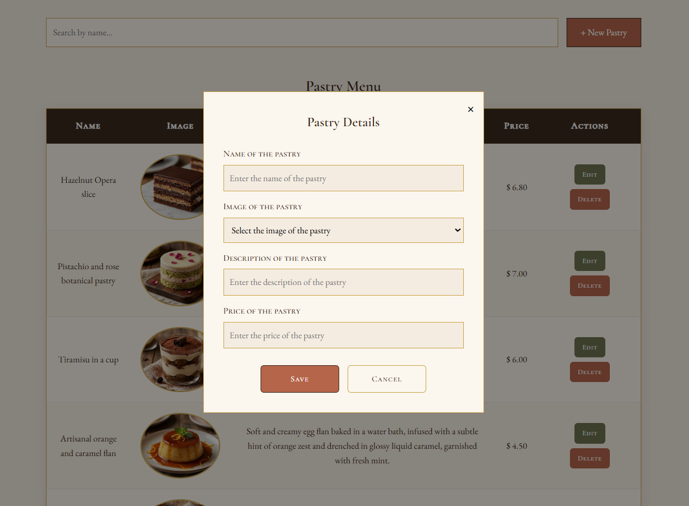
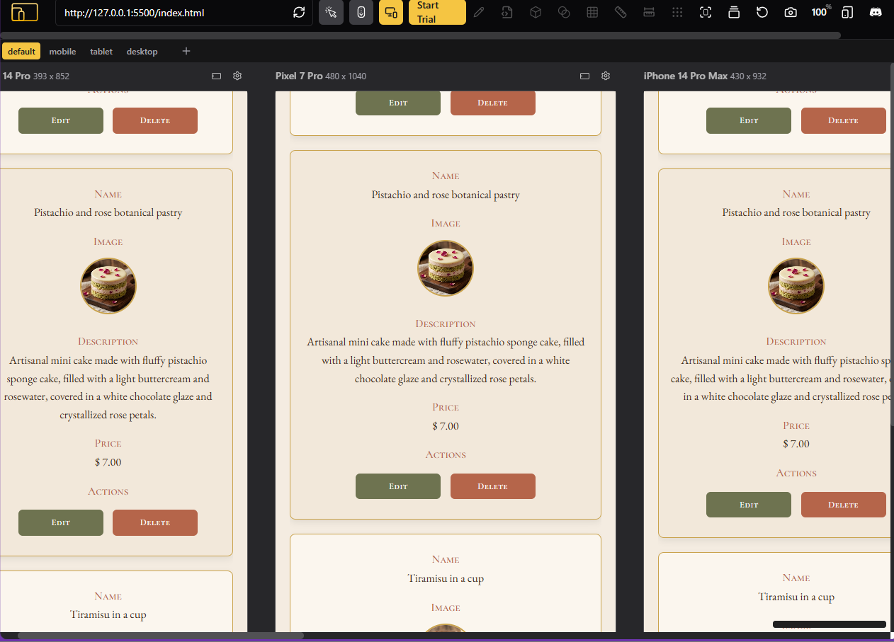

# 🍰 Valentina's Pastry Boutique

A Vanilla JavaScript web app for a boutique patisserie. It combines a public storefront built with custom Web Components and an admin dashboard for full menu management.

## Project Description

Valentina's Pastry is a boutique patisserie web application that dynamically renders products using custom Web Components and includes a fully functional administrative dashboard to manage the pastry menu.

## Features

- **Interactive Storefront:** Dynamically loads and displays menu items from storage inside custom cards.
- **Menu Management (CRUD):** Create, Read, Update, and Delete pastries through a responsive data table.
- **Real-time Search:** Instant filtering of menu items by name.
- **Data Persistence:** Uses browser Local Storage to save and load data across sessions.
- **Responsive Design:** Adapts to mobile and desktop layouts with dynamic accessibility adjustments on small screens.
- **Modal Management:** Pop-up forms to add or edit pastry details.

## Technologies Used

- **HTML5:** Semantic markup structuring the storefront and administration panels.
- **CSS3:** Custom variables, flexbox, grid, media queries, and typography leveraging Google Fonts (Cormorant Garamond, EB Garamond).
- **Vanilla JavaScript (ES6+):** Modules, Local Storage API, DOM manipulation, event delegation, Array methods, and Custom Elements (Shadow DOM API).

## How to Run the Project

1. Clone or Download the repository to your local machine.
2. Open the project folder in your code editor (e.g., VS Code).
3. Ensure you have a live server extension installed (such as Live Server in VS Code) or simply double-click `index.html` to open the main storefront in your default web browser.
4. From the home page, click the **Manage Menu** button to navigate to the CRUD interface (`crud.html`) where you can add new pastries and interact with the data layer.

## Screenshots/Preview

**Storefront View (Web Components)**

**Menu Management (CRUD) View**

**Modal Input Form View**

**Responsive Design**

## Authorship & License

Developed by Valentina Rincon as a Vanilla JavaScript practice project.
All rights reserved © 2026.
